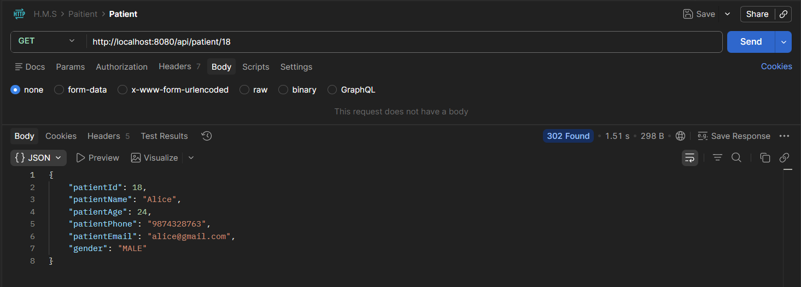
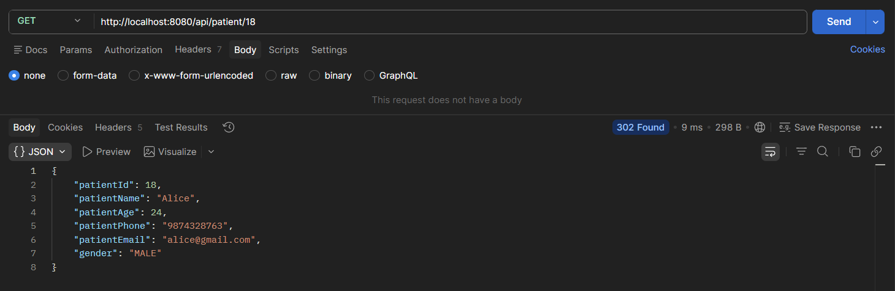
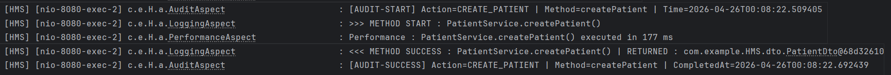
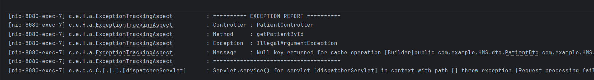
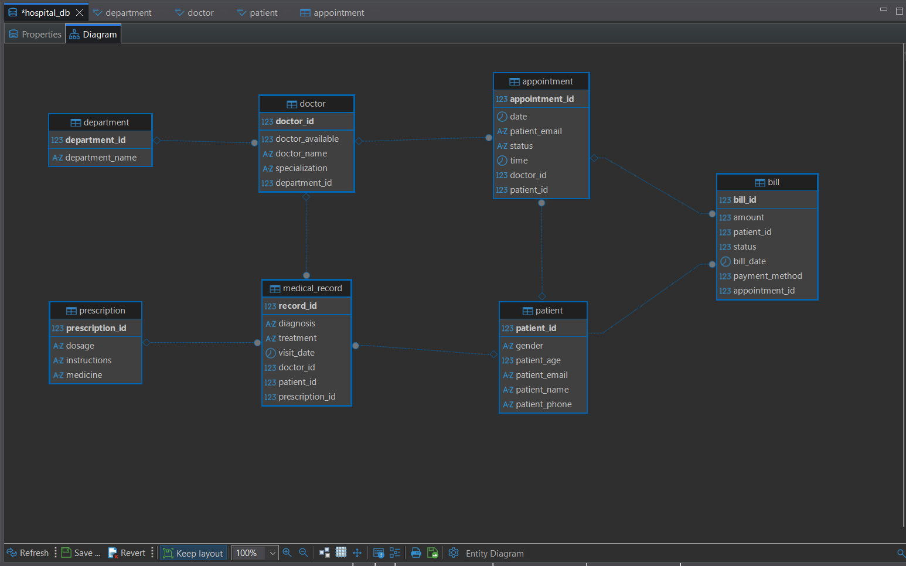

# Hospital Management System (HMS)

A production-grade **Spring Boot** backend application for managing hospital operations including patients, doctors, appointments, billing, prescriptions, and medical records — built with enterprise patterns like Redis caching, AOP, and pagination.

---

## 🚀 Tech Stack

| Layer | Technology |
|---|---|
| **Language** | Java 17 |
| **Framework** | Spring Boot 3.4.5 |
| **Database** | MySQL |
| **ORM** | Spring Data JPA / Hibernate |
| **Caching** | Redis (via Spring Cache) |
| **AOP** | Spring AOP + AspectJ |
| **Build Tool** | Gradle |
| **Logging** | SLF4J + Log4j2 |
| **API Testing** | Postman |

---

## ✨ Key Features

### 🗄️ Core Modules
- Full CRUD REST APIs across 7 hospital entities — Patient, Doctor, Appointment, Bill, Prescription, Medical Record, and Department — with relational linking (e.g. appointments tied to both doctor and patient), filtered queries by ID/specialization/department, and paginated list endpoints.

### ⚡ Redis Caching
- Caching implemented across all 7 service layers using `@Cacheable`, `@CachePut`, `@CacheEvict`
- Smart cache invalidation on create, update, and delete operations
- Custom `CachedPage<T>` wrapper to handle paginated Redis serialization
- 10-minute TTL configured for all cache entries
- Filtered query caching — e.g. doctors by specialization, bills by patient

### 🎯 Aspect Oriented Programming (AOP)
- **LoggingAspect** — Automatic method-level logging across the entire service layer (before, after, on exception)
- **PerformanceAspect** — Execution time tracking with 500ms SLA breach warnings
- **AuditAspect** — Custom `@Auditable` annotation for audit trail on critical business operations (patient admission, appointment booking, bill generation)
- **ExceptionTrackingAspect** — Centralized exception reporting at the controller layer

### 📄 Pagination
- All list endpoints support pagination via `page` and `size` query parameters
- Default: page=0, size=5

---

## 🏗️ Project Structure

```
src/main/java/com/example/HMS/
│
├── annotations/
│   └── Auditable.java               # Custom audit annotation
│
├── aop/
│   ├── LoggingAspect.java           # Service layer method logging
│   ├── PerformanceAspect.java       # Execution time + SLA tracking
│   ├── AuditAspect.java             # Audit trail for business ops
│   └── ExceptionTrackingAspect.java # Controller exception reporting
│
├── config/
│   └── RedisConfig.java             # Redis cache manager setup
│
├── controllers/                     # REST API layer
├── service/                         # Business logic layer
├── repository/                      # JPA repositories
├── entity/                          # JPA entities
├── dto/                             # Request/Response DTOs
├── exception/                       # Custom exceptions
├── enums/                           # Enums (Gender, Status, etc.)
│
└── HmsApplication.java
```

---

## ⚙️ Setup & Running Locally

### Prerequisites
- Java 17+
- MySQL 8+
- Redis 7+ (via WSL or Docker)
- Gradle

### 1. Clone the repository
```bash
git clone https://github.com/yourusername/HMS.git
cd HMS
```

### 2. Start Redis via Docker
```bash
docker run --name hms-redis -p 6379:6379 -d redis:7-alpine
```

### 3. Configure `application.properties`
```properties
# Database
spring.datasource.url=jdbc:mysql://localhost:3306/hms_db
spring.datasource.username=your_username
spring.datasource.password=your_password
spring.jpa.hibernate.ddl-auto=update

# Redis Cache
spring.cache.type=redis
spring.data.redis.host=localhost
spring.data.redis.port=6379
spring.cache.redis.time-to-live=600000
spring.cache.redis.cache-null-values=false
```

### 4. Run the application
```bash
./gradlew bootRun
```

Application starts at `http://localhost:8080`

---

## 📸 Screenshots

### ⚡ Redis Caching — Before vs After

> **Before Caching** — First request hits the DB directly: `1.51s` response time



> **After Caching** — Second request served from Redis: `9ms` response time (~167x faster)



---

### 📋 AOP — Method Logging & Audit Trail

> `AuditAspect`, `LoggingAspect`, and `PerformanceAspect` all firing together on a single `createPatient()` call — showing audit start, method entry, execution time, method success, and audit completion



---

### 🚨 AOP — Exception Report

> `ExceptionTrackingAspect` catching and reporting an exception at the controller layer — controller name, method, exception type, and message all logged centrally



---

### 🗂️ Entity Relationship Diagram

> Relational mapping across all 7 hospital entities — Patient, Doctor, Appointment, Bill, Medical Record, Prescription, and Department



---

## 🧠 Design Decisions

### Why Redis for Caching?
Patient data, doctor lists, and appointment records are frequently read — especially on dashboards and OPD queues. Redis serves 90%+ of reads from cache, drastically reducing DB load. Write operations use `@CacheEvict` to maintain consistency.

### Why AOP?
Cross-cutting concerns like logging, performance tracking, and audit trails would pollute business logic if written directly in service classes. AOP keeps these completely separate — one change in an Aspect reflects across the entire application without touching service code. This follows the **Single Responsibility Principle**.

### Why Custom `@Auditable`?
Critical business operations in a hospital (patient admission, appointment booking, bill generation) require an audit trail. Using a custom annotation keeps the intent declarative and the implementation centralized — any method marked `@Auditable` is automatically tracked without boilerplate.

---

## 📊 Caching Strategy Summary

| Operation | Annotation Used |
|---|---|
| Read by ID | `@Cacheable(key = "#id")` |
| Read all (paginated) | Pagination not cached — avoids stale page data |
| Read filtered lists | `@Cacheable(key = "#filterId")` |
| Create | Not cached — newly created data is unlikely to be read immediate |
| Update | `@CachePut` on single object + `@CacheEvict` on list caches |
| Delete | `@CacheEvict` on single object + all related list caches |

---

## 🔍 AOP Aspects Overview

| Aspect | Pointcut | Advice Type | Purpose |
|---|---|---|---|
| `LoggingAspect` | All service methods | `@Before`, `@AfterReturning`, `@AfterThrowing` | Method entry/exit/exception logging |
| `PerformanceAspect` | All service methods | `@Around` | Execution time + 500ms SLA warning |
| `AuditAspect` | `@Auditable` annotated methods | `@Around` | Business operation audit trail |
| `ExceptionTrackingAspect` | All controller methods | `@AfterThrowing` | Centralized exception reporting |
